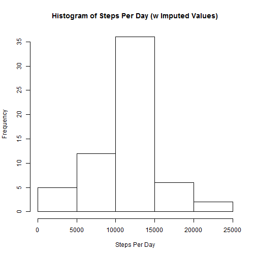

Reproducible Research - Assignment #1
=========================================================

## Setup and Loading Libraries


```r
library(knitr)
knitr::opts_chunk$set(echo=TRUE, scipen = 5, digits = 7)
#load proper libraries
library(data.table)
library(plyr)
library(dplyr)
library(lattice)
```

## Loading and preprocessing the data

```r
# Load data & specify column classes
my.data <- read.csv(unz("activity.zip", "activity.csv"), colClasses = c("numeric", "Date", "numeric"))
dt <- data.table(my.data)
```

## What is mean total number of steps taken per day?
### Total Number of Steps Per Day & Histogram

```r
# Mean total number of steps taken per day
totalstepsperday <- dt[,lapply(.SD,sum), by=date]
hist(totalstepsperday$steps, xlab = "Steps Per Day", main="Histogram of Steps Per Day")
```

 

### Mean and Median Number of Steps

```r
mean_total_steps_per_day <- mean(totalstepsperday$steps, na.rm = TRUE)
mean_total_steps_per_day
```

```
## [1] 10766.19
```

```r
median_total_steps_per_day <- median(totalstepsperday$steps, na.rm = TRUE)
median_total_steps_per_day
```

```
## [1] 10765
```
The mean number of steps is: 10766.19.

The median number of steps is: 10765.

## What is the average daily activity pattern?
### Time Series Plot of the Average Number of Steps Taken By Interval

```r
# Average Daily Activity Pattern
mean_by_interval <- dt[,j= list(mean_by_interval = mean(steps, na.rm = TRUE)), by=interval]
plot(mean_by_interval, type = "l", ylab = "average steps", xlab = "interval", 
     main = "Average Steps By Interval")
```

 

### Interval that, on average, contains the max number of steps

```r
max_avg_steps <- mean_by_interval$interval[mean_by_interval$mean_by_interval == max(mean_by_interval$mean_by_interval, 
                                                                   na.rm = TRUE)]
max_avg_steps
```

```
## [1] 835
```
The interval that on average contains the max number of steps is: 835

## Imputing missing values
### Strategy for imputing missing values
The strategy used for imputing missing values is using the mean, across all days, of the interval that is missing.  Such that if the NA is located in interval 5, the average of all non NA values of interval 5 is used to replace the missing (NA) value, etc.

### Calculation of imputed values and histogram based on imputed values

```r
# Imputing missing values
sum(is.na(dt$steps) * 1)    # total number of missing values
```

```
## [1] 2304
```

```r
# replace NA values with the imputed mean value of interval
impute.mean <- function(x) replace(x, is.na(x), mean(x, na.rm = TRUE))
imputed.data <- ddply(dt, ~ interval, transform, steps = impute.mean(steps))
imputed.data <- data.table(imputed.data)
imputed_totalstepsperday <- imputed.data[,lapply(.SD,sum), by=date]
hist(imputed_totalstepsperday$steps, xlab = "Steps Per Day", main="Histogram of Steps Per Day (w Imputed Values)")
```

 

## Differences in activity patterns between weekdays and weekends?
### Panel plot comparing the average number of steps taken per interval across weekdays and weekends


```r
# differences between weekdays and weekends
imputed.data$weekday_or_weekend <- ifelse(weekdays(imputed.data$date) == "Saturday" | 
                                                weekdays(imputed.data$date) == "Sunday", "weekend", "weekday")
imputed.data$weekday_or_weekend <- as.factor(imputed.data$weekday_or_weekend)

imputed_mean_by_interval <- imputed.data[,j= list(mean_by_interval = mean(steps, na.rm = TRUE)), 
                                         by=list(interval,weekday_or_weekend)]
xyplot(mean_by_interval ~ interval | weekday_or_weekend, 
       data = imputed_mean_by_interval, type = "l", layout = c(1,2))
```

 
